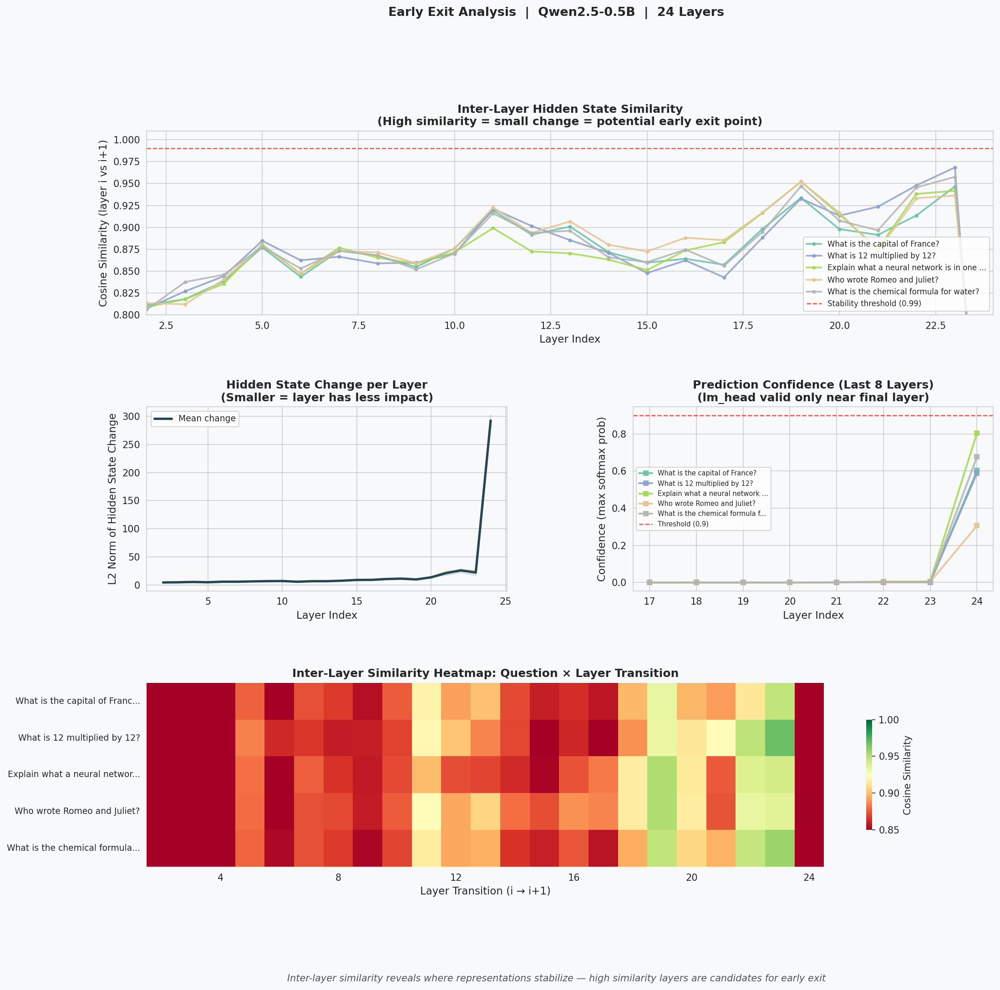
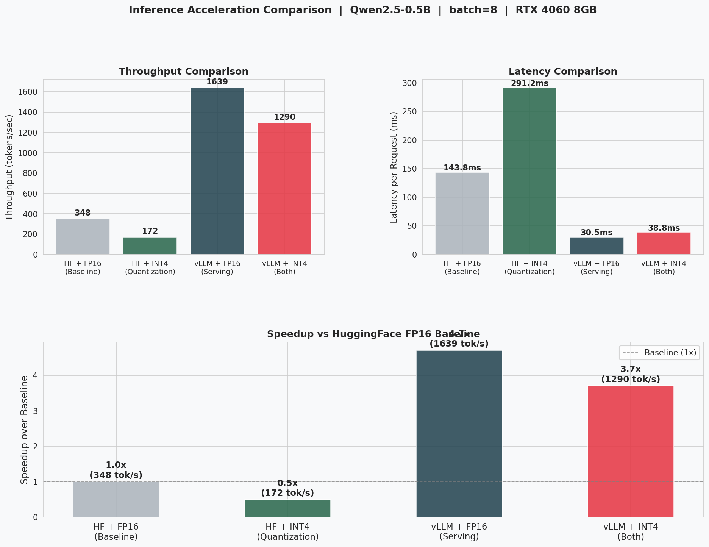

# dLLM Inference Study

Self-directed research on efficient inference for **Diffusion-based Large
Language Models (dLLMs)**, combining systematic paper reading with
hands-on experiments across model analysis, compression, and serving.

## Motivation

Autoregressive LLMs (GPT-style) generate tokens one by one, left to right.
Diffusion LLMs (LLaDA, Dream 7B) generate all tokens simultaneously through
iterative denoising with **bidirectional attention** — a fundamentally
different paradigm that enables richer context but breaks standard inference
optimizations like KV Cache and Flash Attention.

This repository documents my exploration of the efficiency challenges unique
to dLLMs, from understanding the bottlenecks to reproducing key experimental
results from recent papers.

## Papers Studied

| Paper | Venue | Key Contribution |
|-------|-------|-----------------|
| LLaDA | NeurIPS 2024 | Masked diffusion LLM with bidirectional attention |
| Fast-dLLM | arXiv 2025 | Training-free KV Cache + confidence-aware parallel decoding |
| dLLM-Cache | arXiv 2025 | Adaptive caching via differentiated prompt/response strategy |
| Fast-dLLM V2 | arXiv 2025 | Block-diffusion training enabling exact KV Cache |
| Dream 7B | arXiv 2025 | AR→dLLM adaptation from Qwen2.5 backbone |

## Experiments

### 1. LLaDA-8B Activation Similarity Analysis
[`activation_analysis/`](activation_analysis/)

Registered PyTorch forward hooks on all 32 LLaDA-8B-Instruct layers to
collect Attention Output and FFN Output activations across 10 denoising
steps. Two complementary analyses: single-step similarity (reproducing
dLLM-Cache's core finding) and full-trajectory similarity (all 9 adjacent
step pairs).

**Key findings**: Prompt tokens quasi-static (ρ̄ ≈ 0.93–0.98), response
tokens more dynamic (ρ̄ ≈ 0.67–0.77). Sharp similarity drop at Step 6→7
reveals a critical state transition mid-denoising, motivating adaptive
cache refresh as in DLLM-CACHE. Deeper layers (24–31) show consistently
lower similarity than shallow layers.


---

### 2. Quantization Comparison: FP16 vs INT8 vs INT4
[`quantization_comparison/`](quantization_comparison/)

Benchmarked three precisions on Qwen2.5-0.5B using bitsandbytes.

| Precision | VRAM | Speed (tok/s) | Quality |
|-----------|------|---------------|---------|
| FP16 | 0.92 GB | 39.9 | Baseline |
| INT8 | 0.60 GB | 12.0 | Comparable |
| INT4 (NF4) | 0.44 GB | 32.8 | Comparable |

**Finding**: INT8 is slower than INT4 — bitsandbytes dequantizes INT8
weights to FP16 before matrix multiply, adding overhead that dominates
for small models with low compute demand.

---

### 3. LoRA Fine-tuning: Parameter-Efficient SFT
[`lora_finetuning/`](lora_finetuning/)

Applied QLoRA (INT4 + LoRA) to fine-tune Qwen2.5-0.5B on 200 Alpaca
samples for 100 steps. Only 0.17% of parameters trained (540K / 315M).
Loss dropped from 14.48 → 0.71, model learned concise instruction-following
style from Alpaca.

---

### 4. Knowledge Distillation: Teacher → Student
[`knowledge_distillation/`](knowledge_distillation/)

Distilled Qwen2.5-1.5B (Teacher) into Qwen2.5-0.5B (Student) using three
modes: hard label SFT, soft label KD (T=4.0), and mixed (α=0.5).

**Finding**: Soft labels transmit the Teacher's response *style*, not just
the correct answer. Student trained with soft labels produces more detailed
outputs resembling the Teacher — demonstrating that soft labels carry
"dark knowledge" beyond what one-hot labels provide.


---

### 5. Early Exit Analysis: Layer-wise Representation Stability
[`early_exit/`](early_exit/)

Analyzed inter-layer hidden state similarity and L2 change across all 24
layers of Qwen2.5-0.5B to identify potential early exit points.

**Finding**: Every layer makes a meaningful contribution (cosine similarity
stays 0.83–0.97, never reaching 0.99 threshold). Final two layers show
dramatic L2 spikes (~300 vs ~15 for earlier layers) — they are critical
decision layers. Early Exit has limited benefit for compact models;
it is more valuable for 70B+ models where genuine redundant layers exist.



---

### 6. Flash Attention Benchmark
[`flash_attention/`](flash_attention/)

Benchmarked standard attention vs Flash Attention (PyTorch built-in)
across sequence lengths 128–2048.

| Sequence Length | Standard (ms) | Flash (ms) | Speedup |
|----------------|--------------|------------|---------|
| 128 | 0.16 | 0.03 | **4.74x** |
| 512 | 0.09 | 0.05 | 1.92x |
| 2048 | 0.18 | 0.10 | 1.71x |

**Connection to dLLM**: Standard Flash Attention requires causal masking.
dLLMs use bidirectional attention, breaking this assumption. Fast-dLLM V2's
Block-Causal Mask recovers Flash Attention compatibility while preserving
bidirectional generation.


---

### 7. vLLM Batch Scaling
[`vllm_batch_scaling/`](vllm_batch_scaling/)

Measured throughput and latency across batch sizes 1–64 with vLLM's
PagedAttention + Continuous Batching.

| Batch | Throughput (tok/s) | Latency (ms/req) |
|-------|-------------------|-----------------|
| 1 | 191 | 262 |
| 8 | 1,602 | 31 |
| 64 | **9,120** | 6 |

**Finding**: Near-linear throughput scaling — each doubling of batch size
roughly doubles throughput. GPU is not saturated even at batch=64, because
decode is memory-bound and larger batches better amortize weight reads.


---

### 8. Inference Acceleration Comparison
[`inference_comparison/`](inference_comparison/)

Compared four combinations of quantization and serving framework at batch=8.

| Method | Throughput | Speedup |
|--------|-----------|---------|
| HF + FP16 (Baseline) | 348 tok/s | 1.0x |
| HF + INT4 | 172 tok/s | 0.5x |
| vLLM + FP16 | 1,639 tok/s | **4.7x** |
| vLLM + INT4 | 1,290 tok/s | 3.7x |

**Finding**: For small models at moderate batch sizes, the bottleneck is
scheduling, not VRAM capacity — vLLM alone provides the largest gain.
Quantization hurts here due to dequantization overhead, but becomes
essential for larger models that don't fit in FP16.



---

## Setup
```bash
# WSL2 / Linux (for vLLM experiments)
pip install torch transformers accelerate bitsandbytes peft datasets vllm matplotlib seaborn

# Windows (for LLaDA experiments, requires transformers==4.38.2)
pip install torch transformers==4.38.2 accelerate matplotlib seaborn
```

**Models used**:
- `GSAI-ML/LLaDA-8B-Instruct` — dLLM experiments (16GB, CPU offload on 8GB VRAM)
- `Qwen/Qwen2.5-0.5B-Instruct` — compression and serving experiments
- `Qwen/Qwen2.5-1.5B-Instruct` — knowledge distillation teacher

## Hardware

NVIDIA RTX 4060 Laptop GPU (8GB VRAM)  
Windows 11 + WSL2 Ubuntu 24.04

## References

- [LLaDA](https://arxiv.org/abs/2406.11897): Nie et al., NeurIPS 2024
- [dLLM-Cache](https://arxiv.org/abs/2502.11157): Liu et al., arXiv 2025
- [Fast-dLLM V2](https://arxiv.org/abs/2503.09573): arXiv 2025
- [Dream 7B](https://arxiv.org/abs/2502.09992): Ye et al., arXiv 2025
- [Flash Attention](https://arxiv.org/abs/2205.14135): Dao et al., NeurIPS 2022
- [LoRA](https://arxiv.org/abs/2106.09685): Hu et al., ICLR 2022
- [Knowledge Distillation](https://arxiv.org/abs/1503.02531): Hinton et al., 2015
