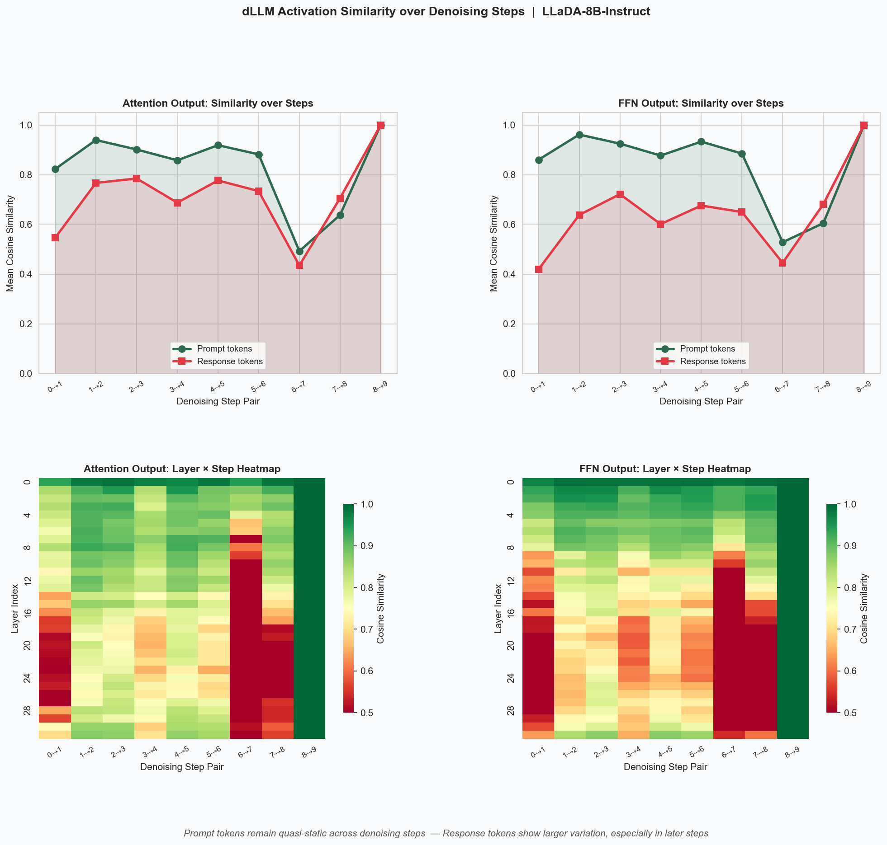
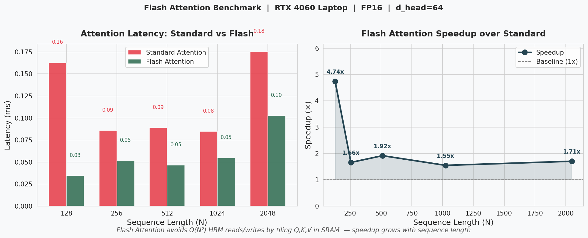

# dLLM Inference Study

Self-directed research on efficient inference for **Diffusion-based Large
Language Models (dLLMs)**, combining systematic paper reading with
hands-on experiments across model analysis, compression, and serving.

## Motivation

Autoregressive LLMs (GPT-style) generate tokens one by one, left to right.
Diffusion LLMs (LLaDA, Dream 7B) generate all tokens simultaneously through
iterative denoising with **bidirectional attention** — a fundamentally
different paradigm that enables richer context but breaks standard inference
optimizations like KV Cache and Flash Attention.

This repository documents my exploration of the efficiency challenges unique
to dLLMs, from understanding the bottlenecks to reproducing key experimental
results from recent papers.

## Papers Studied

| Paper | Venue | Key Contribution |
|-------|-------|-----------------|
| LLaDA | NeurIPS 2024 | Masked diffusion LLM with bidirectional attention |
| Fast-dLLM | arXiv 2025 | Training-free KV Cache + confidence-aware parallel decoding |
| dLLM-Cache | arXiv 2025 | Adaptive caching via differentiated prompt/response strategy |
| Fast-dLLM V2 | arXiv 2025 | Block-diffusion training enabling exact KV Cache |
| Dream 7B | arXiv 2025 | AR→dLLM adaptation from Qwen2.5 backbone |

## Experiments

### 1. LLaDA-8B Activation Similarity Analysis
[`activation_analysis/`](activation_analysis/)

Registered PyTorch forward hooks on all 32 LLaDA-8B-Instruct layers to
collect Attention Output and FFN Output activations across 10 denoising
steps. Two complementary analyses were performed: single-step similarity
(reproducing dLLM-Cache's core finding) and full-trajectory similarity
(tracking dynamics across all 9 adjacent step pairs).

**Key findings**:
- Prompt tokens quasi-static throughout (ρ̄ ≈ 0.93–0.98), response tokens
  more dynamic (ρ̄ ≈ 0.67–0.77) — validating dLLM-Cache's differentiated
  caching design
- Sharp similarity drop at Step 6→7 reveals a critical state transition
  mid-denoising, motivating adaptive (rather than fixed-interval) cache
  refresh as in DLLM-CACHE
- Deeper layers (24–31) show consistently lower similarity than shallow
  layers, suggesting layer-wise caching granularity is worthwhile



---

### 2. Quantization Comparison: FP16 vs INT8 vs INT4
[`quantization_comparison/`](quantization_comparison/)

Benchmarked three quantization precisions on Qwen2.5-0.5B-Instruct using
bitsandbytes, measuring VRAM usage, generation speed, and output quality.

| Precision | VRAM | Speed (tok/s) | Quality |
|-----------|------|---------------|---------|
| FP16 | 0.92 GB | 39.9 | Baseline |
| INT8 | 0.60 GB | 12.0 | Comparable |
| INT4 (NF4) | 0.44 GB | 32.8 | Comparable |

**Finding**: INT8 is slower than INT4 on small models — bitsandbytes
dequantizes INT8 weights to FP16 before matrix multiplication, adding
overhead that dominates when compute demand is low.

---

### 3. LoRA Fine-tuning: Parameter-Efficient SFT
[`lora_finetuning/`](lora_finetuning/)

Applied QLoRA (INT4 quantization + LoRA adapters) to fine-tune
Qwen2.5-0.5B on 200 Alpaca samples for 100 steps.

| | Parameters | % of Total |
|--|-----------|------------|
| Full model | 315,119,488 | 100% |
| LoRA trainable | 540,672 | **0.17%** |

Loss dropped from 14.48 → 0.71. Model learned concise instruction-following
style from Alpaca with only 0.17% of parameters updated.

---

### 4. vLLM Serving: PagedAttention vs HuggingFace
[`vllm_serving/`](vllm_serving/)

Compared throughput between sequential HuggingFace inference and vLLM's
PagedAttention + Continuous Batching on 5 concurrent requests.

| Method | Throughput | Speedup |
|--------|-----------|---------|
| HuggingFace (sequential) | 50.3 tok/s | 1x |
| vLLM (PagedAttention) | 817.0 tok/s | **16x** |

**Finding**: PagedAttention eliminates KV Cache memory fragmentation
(60–80% waste in naive implementations), enabling near-zero fragmentation
and 695× maximum concurrency on 8GB VRAM.

---

### 5. Flash Attention Benchmark
[`flash_attention/`](flash_attention/)

Benchmarked standard attention (explicit HBM read/write of N×N matrices)
against Flash Attention (SRAM tiling, no N×N materialization) across
sequence lengths 128–2048.

| Sequence Length | Standard (ms) | Flash (ms) | Speedup |
|----------------|--------------|------------|---------|
| 128 | 0.16 | 0.03 | **4.74x** |
| 512 | 0.09 | 0.05 | 1.92x |
| 2048 | 0.18 | 0.10 | 1.71x |



**Connection to dLLM**: Standard Flash Attention requires causal masking
for its streaming tiling strategy. dLLMs use bidirectional attention,
breaking this assumption. Fast-dLLM V2's Block-Causal Mask recovers Flash
Attention compatibility while preserving bidirectional generation.

---

## Setup
```bash
pip install torch transformers accelerate bitsandbytes peft datasets vllm matplotlib seaborn
```

- dLLM experiments: `GSAI-ML/LLaDA-8B-Instruct` (~16GB, use `device_map="auto"` for CPU offload on 8GB VRAM)
- Other experiments: `Qwen/Qwen2.5-0.5B-Instruct`

## Hardware

NVIDIA RTX 4060 Laptop GPU (8GB VRAM), Windows 11 + WSL2 Ubuntu 24.04

## References

- [LLaDA](https://arxiv.org/abs/2406.11897): Nie et al., NeurIPS 2024
- [dLLM-Cache](https://arxiv.org/abs/2502.11157): Liu et al., arXiv 2025
- [Fast-dLLM V2](https://arxiv.org/abs/2503.09573): arXiv 2025
- [Dream 7B](https://arxiv.org/abs/2502.09992): Ye et al., arXiv 2025
- [Flash Attention](https://arxiv.org/abs/2205.14135): Dao et al., NeurIPS 2022