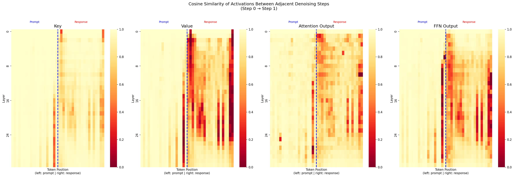

# dLLM Inference Study

Self-directed study on efficient inference for Diffusion-based Large Language Models (dLLMs), with a focus on understanding and reproducing key experimental findings from recent papers.

## Motivation

Diffusion LLMs (dLLMs) such as LLaDA represent a promising alternative to autoregressive language models. Unlike GPT-style models that generate tokens left-to-right, dLLMs generate all tokens simultaneously through an iterative denoising process with bidirectional attention. This architectural difference makes standard inference optimizations (e.g., KV Cache) non-trivially applicable, motivating a line of recent work on efficient dLLM inference.

This repository documents my hands-on exploration of this space, from implementing core architectures from scratch to reproducing experimental results from published papers.

## What I Built

### 1. From-Scratch Implementations
- **GPT**: Full implementation including multi-head attention, causal masking, feedforward network, residual connections, positional embeddings, and autoregressive training loop
- **LLaDA**: Built on top of GPT, with bidirectional attention (no causal mask), forward masking process, masked-position-only loss, and reverse denoising generation

### 2. Papers Studied
| Paper | Venue | Key Idea |
|-------|-------|----------|
| LLaDA: Large Language Diffusion with Masking | NeurIPS 2024 | Masked diffusion LLM with bidirectional attention |
| Fast-dLLM | arXiv 2025 | Training-free KV Cache + confidence-aware parallel decoding |
| dLLM-Cache | arXiv 2025 | Adaptive caching via differentiated prompt/response strategy |
| Fast-dLLM V2 | arXiv 2025 | Block-diffusion training enabling exact KV Cache |
| Dream 7B | arXiv 2025 | Diffusion LLM adapted from pretrained AR model |

### 3. Reproduction: dLLM-Cache Figure 1

Reproduced the core activation similarity analysis from dLLM-Cache on **LLaDA-8B-Instruct**.

**Method**: Registered PyTorch forward hooks on all 32 Transformer layers to collect Key, Value, Attention Output, and FFN Output activations across 10 denoising steps. Computed cosine similarity between adjacent steps for each token position and layer.

**Result**:



**Finding**: Consistent with the paper's core observation:
- **Prompt tokens** (left of dashed line): cosine similarity 0.93-0.98 across all layers and features, confirming that prompt activations are quasi-static across denoising steps
- **Response tokens** (right of dashed line): notably lower similarity, especially for Value vectors (mean 0.67), with sharp drops at positions just unmasked between steps

This directly motivates the dLLM-Cache design: prompt features can be cached with long refresh intervals, while only a small fraction of response tokens need recomputation at each step.

## Repository Structure
```
dllm-inference-study/
├── figure1_reproduction/
│   ├── collect_activations.py   # Hook-based activation collection during inference
│   └── visualize_similarity.py  # Cosine similarity computation and heatmap plotting
├── results/
│   └── figure1_reproduction.png # Reproduced heatmap
└── README.md
```

## Setup
```bash
pip install torch transformers accelerate matplotlib seaborn
```

Model: `GSAI-ML/LLaDA-8B-Instruct` (loaded via HuggingFace, ~16GB)

Run activation collection:
```bash
python figure1_reproduction/collect_activations.py
```

Run visualization:
```bash
python figure1_reproduction/visualize_similarity.py
```

## Key Technical Details

- **Hook mechanism**: Used `register_forward_hook` on `k_proj`, `v_proj`, `attn_out`, and `ff_out` layers of each Transformer block to capture intermediate activations without modifying model source code
- **Device handling**: Model loaded with `device_map="auto"` (CPU offloading) to fit LLaDA-8B on 8GB VRAM
- **Similarity metric**: Cosine similarity computed per token position along the `d_model=4096` dimension

## References

- [LLaDA](https://arxiv.org/abs/2406.11897): Nie et al., NeurIPS 2024
- [Fast-dLLM](https://arxiv.org/abs/2505.22618): Wu et al., arXiv 2025
- [dLLM-Cache](https://arxiv.org/abs/2502.11157): Liu et al., arXiv 2025
- [Dream 7B](https://arxiv.org/abs/2502.09992): Ye et al., arXiv 2025