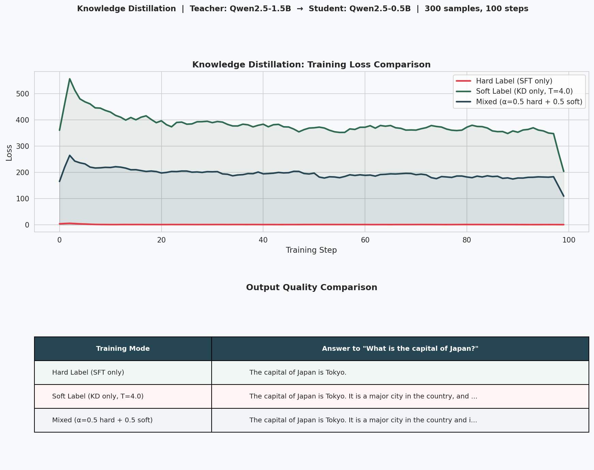

## Knowledge Distillation: Teacher-Student Training

Teacher: Qwen2.5-1.5B-Instruct  
Student: Qwen2.5-0.5B-Instruct  
Hardware: NVIDIA RTX 4060 Laptop GPU (8GB VRAM)  
Data: tatsu-lab/alpaca (300 samples, 100 steps, batch_size=4)

### Experiment Design

Three training modes are compared:

| Mode | Loss Function |
|------|--------------|
| Hard Label (SFT) | Cross-entropy with ground truth labels |
| Soft Label (KD) | KL divergence with Teacher's softened output distribution |
| Mixed | α × hard_loss + (1-α) × soft_loss, α=0.5 |

Temperature T=4.0 is applied to soften the Teacher's logits before
computing the soft label distribution. Higher temperature makes the
distribution more uniform, amplifying information in the low-probability
tokens ("dark knowledge").



### Results

**Loss curves**: Hard label loss (cross-entropy) and soft label loss
(KL divergence × T²) are on different scales and cannot be compared
directly. Within each mode, all three show consistent convergence.

**Output quality**:
- Hard Label → concise answers ("The capital of Japan is Tokyo.")
  Student learns Alpaca's terse instruction-following style
- Soft Label → more detailed answers, resembling Teacher's style
  Student inherits Teacher's tendency to elaborate
- Mixed → similar to Soft Label, combining both signals

### Key Finding

Soft labels transmit not just "what the answer is" but "how the Teacher
tends to answer" — including its preferred style, level of detail, and
uncertainty over alternative phrasings. This is the core value of
knowledge distillation beyond standard supervised fine-tuning.

### Why Soft Labels Work

With hard labels, all probability mass is on the correct token:
```
hard label: [0, 0, 0, 1, 0, ...]   ← only "Tokyo" gets signal
```

With soft labels (T=4), the Teacher's distribution is smoothed:
```
soft label: Tokyo=0.65, Japan=0.08, Kyoto=0.05, ...
```

The student learns that "Japan" and "Kyoto" are plausible continuations,
gaining richer gradient signal than a one-hot label provides. This
regularization effect makes soft-label training more stable and often
leads to better generalization.

### Technical Notes

- Student loaded in BF16 (more numerically stable than FP16 for training)
- Teacher loaded in FP16 (inference only, no gradient computation)
- KL divergence computed in FP32 to avoid numerical overflow
- Learning rate: 1e-5 (lower than standard SFT due to distillation stability)
