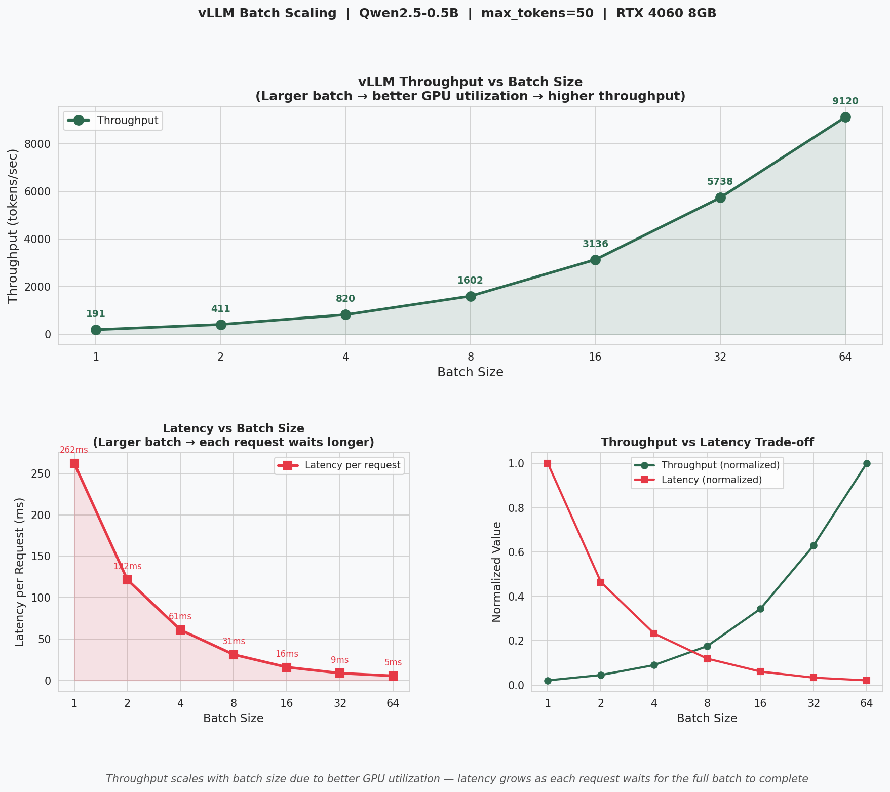

## vLLM Batch Scaling: Throughput vs Latency

Model: Qwen2.5-0.5B-Instruct  
Hardware: NVIDIA RTX 4060 Laptop GPU (8GB VRAM)  
Framework: vLLM 0.18.0 (PagedAttention + Continuous Batching)  
Config: max_tokens=50, gpu_memory_utilization=0.8, 3 runs averaged

### Results

| Batch Size | Throughput (tok/s) | Latency (ms/req) |
|-----------|-------------------|-----------------|
| 1         | 191               | 262             |
| 2         | 411               | 122             |
| 4         | 820               | 61              |
| 8         | 1,602             | 31              |
| 16        | 3,136             | 16              |
| 32        | 5,738             | 9               |
| 64        | 9,120             | 6               |



### Key Findings

**Near-linear throughput scaling**: Throughput approximately doubles
with each doubling of batch size (191→411→820→1602→3136→5738→9120).
At batch=64, GPU is still not saturated — larger batches would yield
further gains if VRAM allowed.

**Latency decreases with batch size**: Counterintuitively, per-request
latency drops from 262ms (batch=1) to 5ms (batch=64). This is because
vLLM's Continuous Batching processes all requests in parallel — total
wall-clock time stays roughly constant (~0.25s) while the cost is
amortized across more requests.

**The throughput-latency trade-off**: The right subplot shows the
efficiency frontier. For latency-sensitive applications (real-time chat),
small batches are preferred. For throughput-optimized workloads
(batch inference, offline processing), larger batches maximize GPU
utilization.

### Why Batching Helps: Memory-Bound Decode

LLM decode is memory-bound: each step reads the entire model weights
from HBM to compute one new token per request. With batch=1, each weight
read serves only 1 token computation — GPU utilization is low.

With batch=64, the same weight read serves 64 simultaneous token
computations. The HBM bandwidth bottleneck is amortized across more work,
dramatically improving effective throughput.
```
batch=1:  read weights once → compute 1 token  (low utilization)
batch=64: read weights once → compute 64 tokens (64x better utilization)
```

This is why Continuous Batching (vLLM's core innovation) is so effective:
it keeps the batch full at all times by slotting in new requests the
moment a slot frees up.

### Connection to dLLM

In dLLM inference, each denoising step runs the full model — equivalent
to one decode step in AR inference. Batching multiple dLLM requests
together would yield the same throughput gains shown here. However,
dLLMs have the additional complexity that different requests may be at
different denoising steps simultaneously, making batch scheduling more
challenging than in AR inference.
